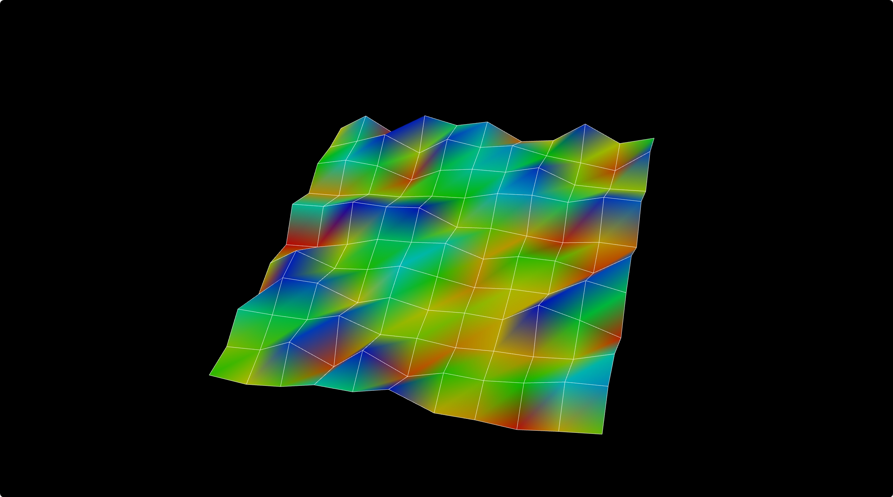
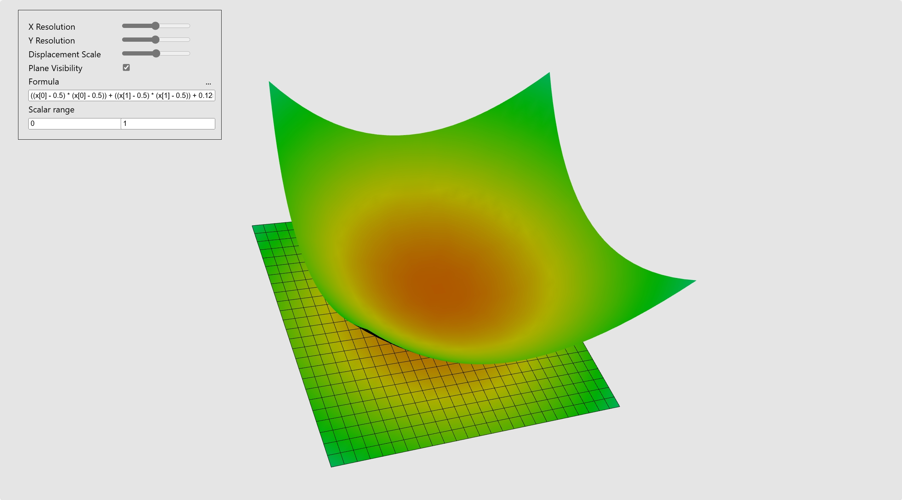
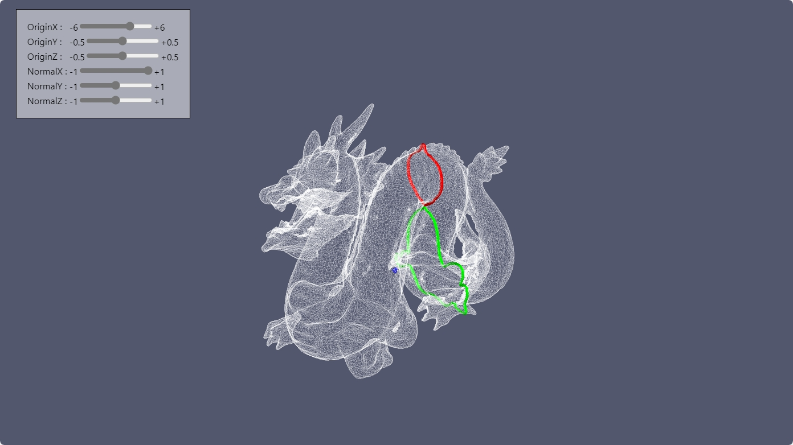
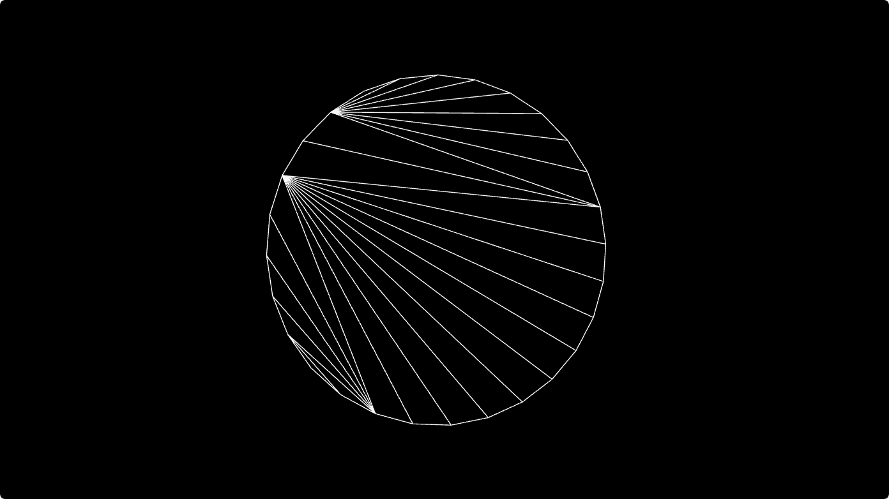
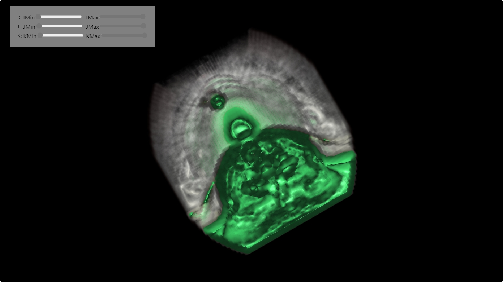

# learning-vtkjs
some code examples/files/data about how to use vtkjs in react
# Getting Started with Create React App

--documentation
 some files about vtk developing
--learning-vtkjs-app
 main code example about vtk with React framework

## Available Scripts

In the project directory,which is `/learning-vtkjs-app` , you can run:

```js
1. cd learning-vtkjs-app
2. npm install
3. npm run start
```
### `npm start`

Runs the app in the development mode.\
Open [http://localhost:3000](http://localhost:3000) to view it in your browser.

The page will reload when you make changes.\
You may also see any lint errors in the console.


## learning  screenshot
vtkSource


Filters/WarpScalar


Filters/Calculator


Filters/ContourLoopExtraction


Filters/ContourTriangulator


Filters/ImageCropFilter


## Learn More

WeChat : HugeYen\
WeChat Public Account : BIM树洞

